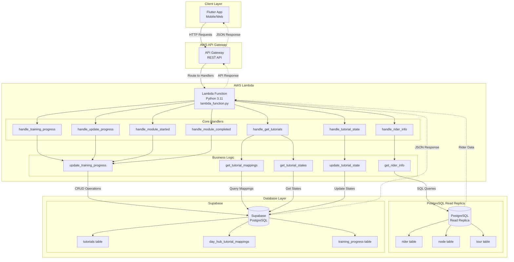
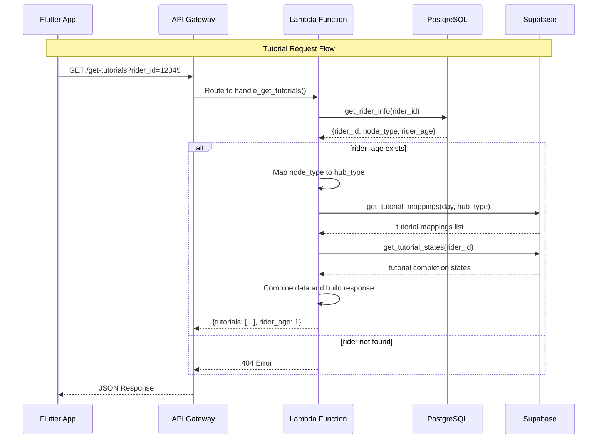
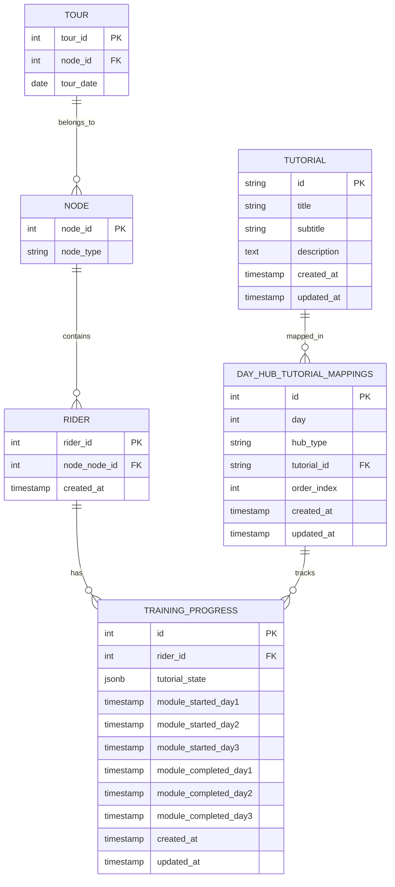
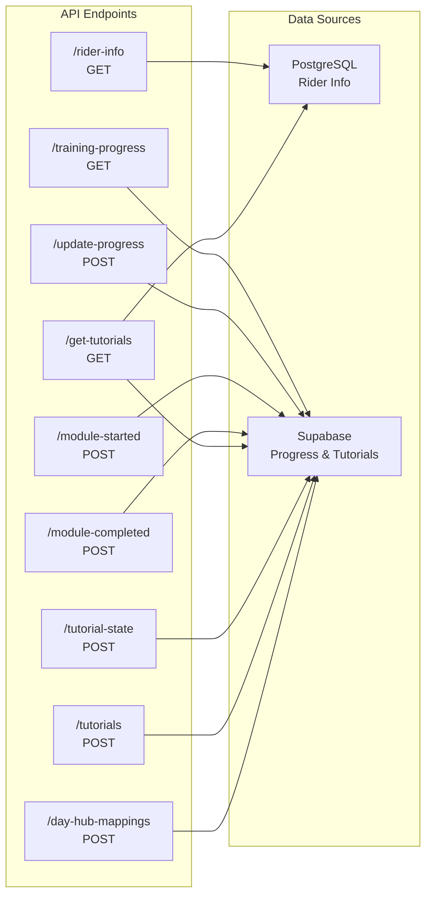
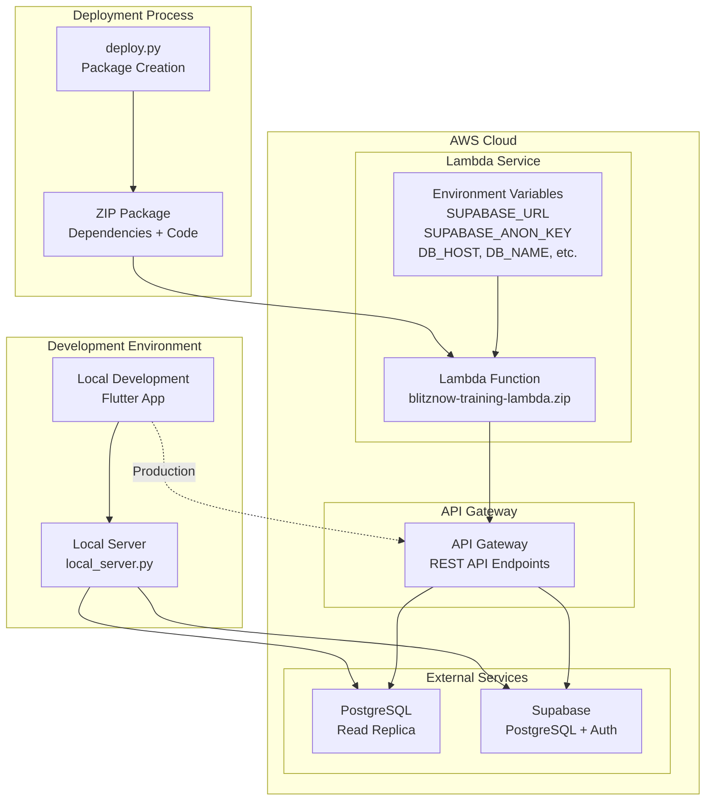

# BlitzNow Training App - Lambda Architecture Diagram

## System Architecture Overview

## Detailed Data Flow

## Database Schema Relationships

## API Endpoints Flow

## Deployment Architecture

## Key Features Highlighted

### 1. **Serverless Architecture**
- Auto-scaling Lambda function
- Pay-per-request pricing model
- No server management required

### 2. **Multi-Database Strategy**
- PostgreSQL for business logic (rider data)
- Supabase for tutorial management and progress tracking
- Read replicas for performance

### 3. **RESTful API Design**
- Clean endpoint structure
- Consistent error handling
- CORS support for web clients

### 4. **Business Logic Separation**
- Rider age calculation (1, 2, 3 days)
- Hub type mapping (lm_hub, quick_hub)
- Tutorial personalization based on rider profile

### 5. **Progress Tracking**
- Module start/completion timestamps
- Individual tutorial completion states
- JSONB storage for flexible state management

This architecture provides a scalable, maintainable solution for the BlitzNow training system with clear separation of concerns and efficient data management.
